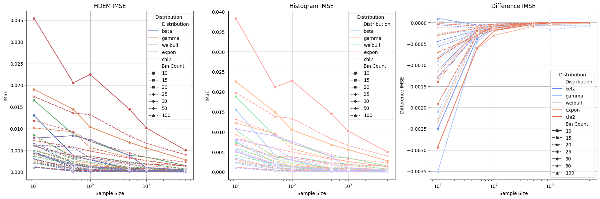

# Histogram Density Estimation Method (HDEM) Repository

## Overview

This repository contains a set of Python scripts implementing the Histogram Density Estimation Method (HDEM) for estimating the probability density function of a given dataset. The method works by analyzing the frequency of data within various ranges (bins) and then smoothing these frequencies to produce a continuous density estimation.

The repository includes the following files:

- `hdem.py`: The core script that defines the `HDEMethod` class and includes methods for performing density estimation.
- `experiment.py`: A script that runs experiments with the HDEMethod on various distributions and computes error metrics.
- `visualize.py`: A script that takes the results of the experiments and generates visualizations for a better understanding of the error metrics.

## How to Use

To replicate the results and validate the performance of the HDEMethod, follow these steps:

1. Ensure you have Python installed on your system.
2. Install the required Python packages with `pip install numpy scipy matplotlib seaborn pandas sklearn`.
3. Run the `experiment.py` script to perform the experiments and save the results as `experiment_results.csv`.
4. Run the `visualize.py` script to generate visualizations from the results.

Each script can be run independently using the command line:

```bash
python hdem.py
python experiment.py
python visualize.py
```

# Step-by-Step Instructions

- Clone this repository to your local machine.
- Navigate to the repository directory in your command-line interface.
- Install the required dependencies listed above.
- Execute `experiment.py` to run the experiments.
- Execute `visualize.py` to create visualizations.

## Method Explanation

Imagine you have a bunch of observations, like a list of ages at a school. Now, you want to make a smooth curve that tells you how many kids there are around each age. The HDEMethod does this by creating a histogram, which is like a bar chart that shows how many kids fall into different age groups (these groups are called bins).

Once we have our histogram, we don't just look at how many kids are in one bin to estimate our curve. Instead, we look at the nearby bins too. This way, we get a smoother, more averaged out idea of how many kids are around each age, rather than sharp jumps between each group.

To make sure we're not just making random guesses, we calculate what we expect to see based on all the bins we've looked at. We do this for different widths of bins to see what gives us the smoothest, most accurate curve. In the end, we choose the one that fits our actual observations the best.

This method is cool because it's less likely to get tricked by weird patterns or very different numbers in the bins. It makes our final curve (density estimate) more reliable for understanding the real pattern of ages at the school.

## Highlights of the Proposed Method

- **Uniform Bins**: The data space is split into equal-sized bins.
- **Density Estimates**: Calculate the density of data within each bin.
- **Nearby Bins**: Look at nearby bins to get a better estimate.
- **Expected Value**: Average over different bin combinations to find the expected density value.
- **Optimal Width**: Select the best interval width (ω) that maximizes the expected average density.
- **Normalization**: Use a normalizing constant to make sure our final estimate is scaled correctly.
- **Weighting Function**: This function penalizes wider bins, favoring more precise estimates.

The HDEMethod is particularly useful when you need to estimate the underlying pattern or distribution of a dataset and is robust against variations that might lead to less accurate density estimates.

Figure below shows integrated mean squared error across varied bin count, sample count in cases of ßeveral selected sample probability distributions:


## Suitability for low resource environments

The Histogram Density Estimation Method (HDEMethod) is well-suited for low-resource hardware for several reasons:

**Computational Simplicity:** Histograms are fundamentally simple structures that involve counting the number of observations within predefined intervals (bins). This process doesn't require complex mathematical computations, which can be beneficial for hardware with limited processing power.

**Memory Efficiency:** Unlike some other density estimation techniques (e.g., kernel density estimation), histograms do not require storing large matrices or performing operations that have high memory demands. The method primarily relies on incrementing counts in an array, which is generally memory-efficient.

**Scalability:** The method can be scaled to handle large datasets by adjusting the bin width and the number of bins. For large datasets, using fewer and wider bins can reduce computational and memory requirements, making the method more adaptable to hardware constraints.

**Parallelizability:** The task of counting observations within bins can be easily parallelized. If the low-resource hardware supports parallel processing (even at a basic level), this can speed up computation without the need for high-end hardware capabilities.

**Incremental Update:** If new data comes in, you do not need to recompute the entire histogram. You can simply update the relevant bins, which is a low-cost operation.

**Simplicity of Implementation:** The method can be implemented with basic programming constructs and does not require advanced libraries or software, making it suitable for systems where such resources might not be available.

HDEMethod offers a good balance between simplicity, efficiency, and effectiveness for density estimation, making it a reasonable choice for low-resource hardware, especially when there's a need to process data with limited computational and memory capacity.
